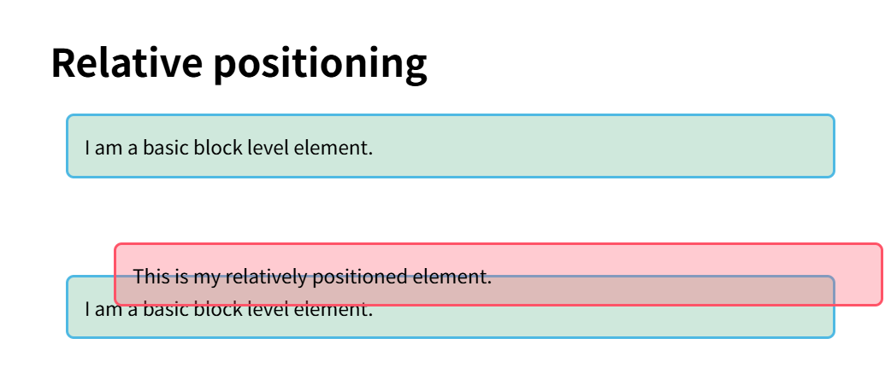
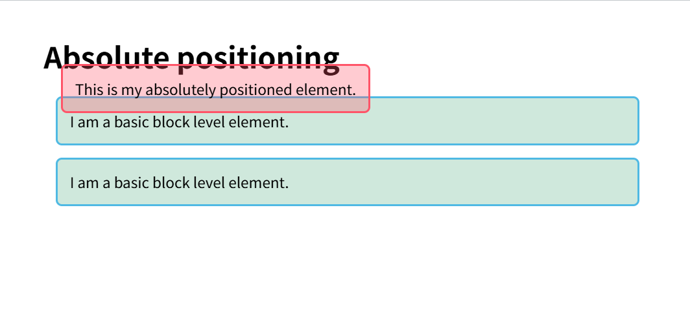

## 学习目标

- 学习基础语法（最基本）
- 学习如何控制元素的位置（最重要）
- 学习如何设置元素的大小，颜色等

## CSS语法基础

```css
h1 {
  color: red;
  font-size: 2.5em;
}
```

- 选择器 `{ 属性 : 属性值; }`

## 盒子类型

一个元素的完整 `display`属性值（如 `display: flex;`）实际上定义了两个东西：

**外部显示类型**：决定了**盒子本身**在正常流中如何布局。即，它如何与周围的兄弟元素相处。

**内部显示类型**：决定了**盒子内部的直接子元素**如何布局。即，它的孩子们应该遵守什么规则。

格式通常是：`display: <outer-display-type> <inner-display-type>;`

### 外部显示类型

- 块级盒子 - 外部显示类型为 `block`

> 在页面流中独占一行
>
> 宽度（`width`）、高度（`height`）、上下内外边距（`margin`, `padding`）都有效
>
> 参与块格式化上下文


- 行内盒子 - 外部显示类型为 `inline`

> 不会产生换行
>
> **水平**方向的内外边距有效，但**垂直**方向的内外边距**不会推开**其他行内或块级元素（可能会重叠或溢出）。设置 `width`和 `height`无效
>
> 参与行内格式化上下文


- 行内块级盒子 - 外部显示类型为 `inline-block`

> **对外**像一个行内元素（不换行，与其他行内元素共处一行）
>
> **对内**像一个块级元素（可以设置宽度、高度以及所有方向的内外边距）

### 内部显示类型

- 常规流布局 - 内部显示类型为 `flow`
- Flex 布局 - 内部显示类型为 `flex`

> 设置 `display: flex;`时，它的完整含义是 `display: block flex;`
>
> **外部类型**：`block`（该容器本身是块级元素，独占一行）
>
> **内部类型**：`flex`（其直接子元素将参与 Flex 弹性盒布局）
>
> 子元素不再是简单的块级或行内元素，它们变成了 **Flex 项目**，受 Flex 容器属性的控制


- Grid 布局 - 内部显示类型为 `grid`

> 设置 `display: grid;`时，它的完整含义是 `display: block grid;`
>
> **外部类型**：`block`（该容器本身是块级元素，独占一行）
>
> **内部类型**：`grid`（其直接子元素将参与 Grid 网格布局）
>
> 子元素变成了 **Grid 项目**，可以被精确地放置到由行和列定义的网格中

## 盒子模型

CSS 盒模型整体上适用于区块盒子，它定义了盒子的不同部分（外边距、边框、内边距和内容）如何协同工作，以创建一个在页面上可以看到的盒子。


### 标准盒子模型

也被称为 `content-box`，这是CSS的**默认值**。

- **规则**：你设置的 `width`和 `height`**只代表内容区域**的尺寸。
- **元素总尺寸计算公式**：
  - **总宽度** = `width` + `左右padding` + `左右border` + `左右margin`
  - **总高度** = `height` + `上下padding` + `上下border` + `上下margin`

### 替代盒子模型

也被称为 `border-box`。这个模型更直观，也是现在更推荐使用的模型。

- **规则**：你设置的 `width`和 `height`**代表内容、内边距和边框的总和**。
- **元素总尺寸计算公式**：
  - **总宽度** = `width` + `左右margin`
  - **总高度** = `height` + `上下margin`

## 层叠

- 当应用两条同级别的规则到一个元素的时候，写在后面的就是实际使用的规则。

```css
h1 {
  color: red;
}
h1 {
  color: blue;
}
```

- 优先级：选择器越具体，它的优先级就越高。例如下面的颜色将显示红色

```html
<h1 class="main-heading">这是我的标题。</h1>
```

```css
.main-heading {
  color: red;
}

h1 {
  color: blue;
}
```


## 定位

定位 (positioning) 能够让我们把一个元素从它原本在正常布局流 (normal flow) 中应该在的位置移动到另一个位置。

- **静态定位**（Static positioning）是每个元素默认的属性——它表示“将元素放在文档布局流的默认位置——没有什么特殊的地方”。
- **相对定位**（Relative positioning）允许我们相对于元素在正常的文档流中的位置移动它——包括将两个元素叠放在页面上。这对于微调和精准设计（design pinpointing）非常有用。
- **绝对定位**（Absolute positioning）将元素完全从页面的正常布局流（normal layout flow）中移出，类似将它单独放在一个图层中。我们可以将元素相对于页面的 `<html>` 元素边缘固定，或者相对于该元素的*最近被定位祖先元素*（nearest positioned ancestor element）。绝对定位在创建复杂布局效果时非常有用，例如通过标签显示和隐藏的内容面板或者通过按钮控制滑动到屏幕中的信息面板。
- **固定定位**（Fixed positioning）与绝对定位非常类似，但是它是将一个元素相对浏览器视口固定，而不是相对另外一个元素。这在创建类似在整个页面滚动过程中总是处于屏幕的某个位置的导航菜单时非常有用。

下面将以这段html来介绍定位

```HTML
<h1>Positioning</h1>

<p>I am a basic block level element.</p>
<p class="positioned">I am a basic block level element.</p>
<p>I am a basic block level element.</p>
```


### 相对定位

相对定位 (relative positioning) 让你能够把一个正常布局流 (normal flow) 中的元素从它的默认位置按坐标进行相对移动。（**相对定位的元素仍然在正常布局流中**，**原本在文档流中的位置会被保留**，其他元素不会填补它的原始位置）

```css
.positioned {
  position: relative;
  background: rgba(255, 84, 104, 0.3);
  border: 2px solid rgb(255, 84, 104);
  top: 30px;
  left: 30px;
}
```



### 绝对定位

绝对定位用于将元素移出正常布局流 (normal flow)，以坐标的形式相对于它的容器定位到 web 页面的任何位置

```css
.positioned {
  position: absolute;
  background: rgba(255, 84, 104, 0.3);
  border: 2px solid rgb(255, 84, 104);
  top: 30px;
  left: 30px;
}
```



> 绝对定位的 `top`, `right`, `bottom`, `left`的参考基准取决于**最近的定位祖先元素**
>
> 没有定位祖先元素时，那么是相对于初始包含块（通常是html)


### 固定定位


固定定位 (fixed positioning) 同绝对定位 (absolute positioning) 一样，将元素从文档流 (document flow) 当中移出了。但是，定位的坐标不会应用于"容器"边框来计算元素的位置，而是会应用于视口 (viewport) 边框。


```html
<h1>Fixed positioning</h1>

<div class="positioned">Fixed</div>

<p>Paragraph 1.</p>
<p>Paragraph 2.</p>
<p>Paragraph 3.</p>
```


```css
.positioned {
  position: fixed;
  top: 30px;
  left: 30px;
}
```

